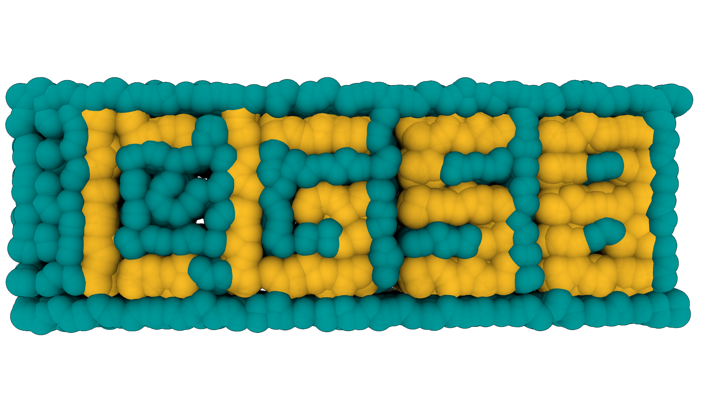
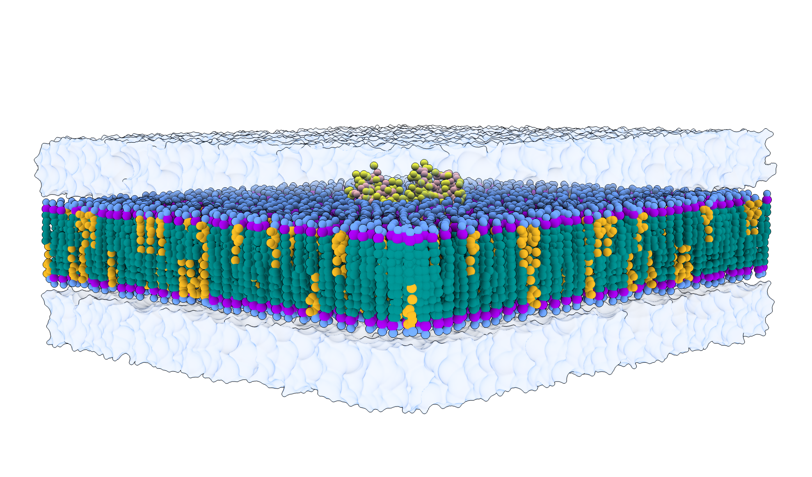

# Coarse-grained System Builder (CGSB)

CGSB is a Python-based software for building flat membranes in coarse-grained resolution. It handles asymmetric membranes, phase-separated systems, multiple bilayers, protein insertion, solvation and flooding with one or multiple solute molecules of choice.

CGSB is versatile, fast, easy-to-use, but it also allows for high-level of customisation. It can be used either as a **Python package** or directly from the **terminal command line**. It neatly handles multiple parameter libraries (even within the same system), making it developer-friendly. 

CGSB is continuously under development and we welcome suggestions for new features. 

## Citation

Andreasen _et al._ (2024) TBD.

## Installation 

**Version 1**

    conda env create -f environment.yml 

    conda activate CGSB

    python -m ipykernel install --user --name=CGSB

**Version 2**

    conda create --name CGSB python==3.9

    conda activate CGSB

    pip install numpy==1.21.5 scipy==1.7.3 alphashape matplotlib ipykernel ipywidgets

    python -m ipykernel install --user --name=CGSB

## Basic usage 

For a detailed introduction to the software, please consult [CGSB Documentation](CGSB_Documentation.pdf).

For a quick reminder of available commands, you can use the [Cheat Sheet](CGSB_Cheat_Sheet.pdf).

A [tutorial](Tutorial) is available as a Jupyter Notebook and it systematically presents build procedures, from very simple to very complex systems.

It includes:

* **simple system**: simple POPC membrane in solvent (water + 0.15 M NaCl)
* **basic system**: symmetric complex membrane (POPC and CHOL) in solvent
* **membrane with protein system**: symmetric complex membrane with specified membrane APL and a transmembrane protein
* **asymmetric membrane system**: asymmetric complex membrane with bespoke APL values in each leaflet
* **protein in solvent**: protein in water and 0.15 M NaCl, without a membrane
* **phase-separated system**: membrane with defined patches of different compositions
* **phase-separated system generator**: a code for making of customisable grid of membrane patches
* **multiple bilayers system**: two membranes offset in the z direction
* **monolayer system**: upper-facing complex monolayer
* **mixed solvent system**: symmetric complex membrane solvated with regular and small water beads in specified ratios
* **flooding system**: flooding the membrane-containing system with solute molecules, followed by solvation
* **abstract art**: just for fun

## License

CGSB is preserved under the [Apache License 2.0](https://github.com/MikkelDA/CGSB/blob/main/LICENSE).

