# CGSB Tutorial

For a detailed introduction to the software, please consult [CGSB Documentation](../CGSB_Documentation.pdf).

For a quick reminder of available commands, you can use the [Cheat Sheet](../CGSB_Cheat_Sheet.pdf).

This tutorial is available as a Jupyter Notebook and it systematically presents build procedures, from very simple to very complex systems.

It includes:

* **Basic system**: A simple POPC membrane in solvent (water + 0.15 M NaCl)

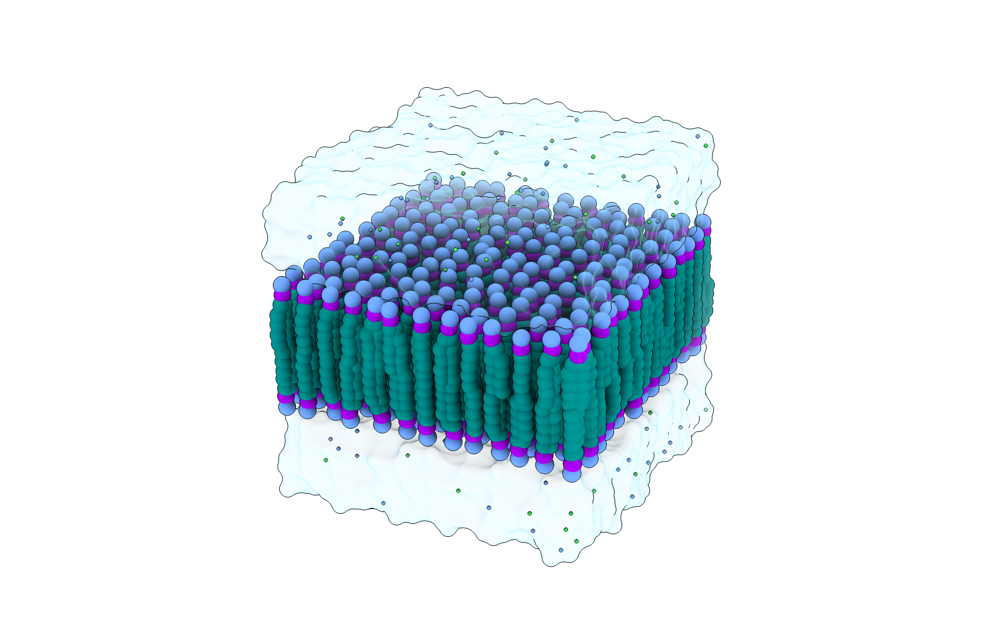

* **Simple system**: A symmetric complex membrane (POPC and CHOL) in solvent

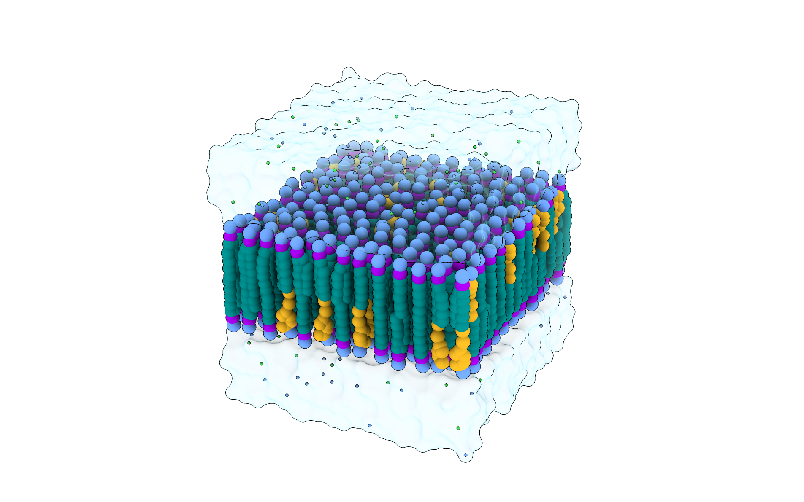

* **Membrane with protein system**: A symmetric complex membrane with a specified membrane APL and a transmembrane protein

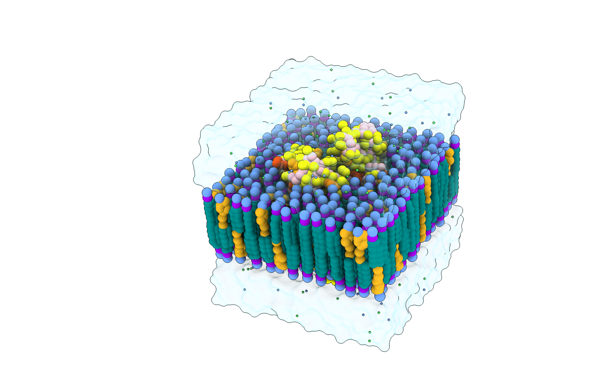

* **Asymmetric membrane system**: An asymmetric complex membrane with bespoke APL values in each leaflet

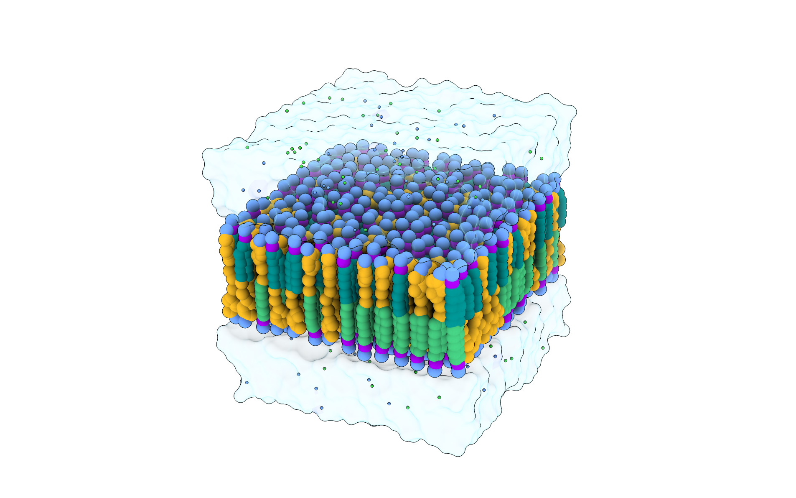

* **Protein in solvent**: A protein in water and 0.15 M NaCl, without a membrane

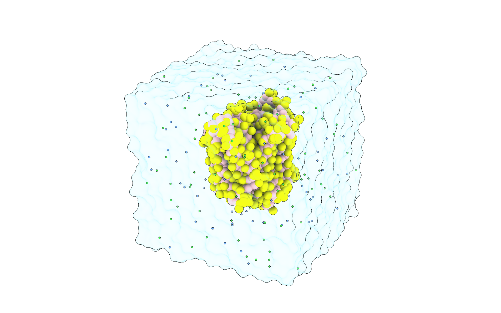

* **Phase-separated system**: A membrane with defined patches of different compositions

* **Phase-separated system generator**: Code for creating a customisable grid of membrane patches

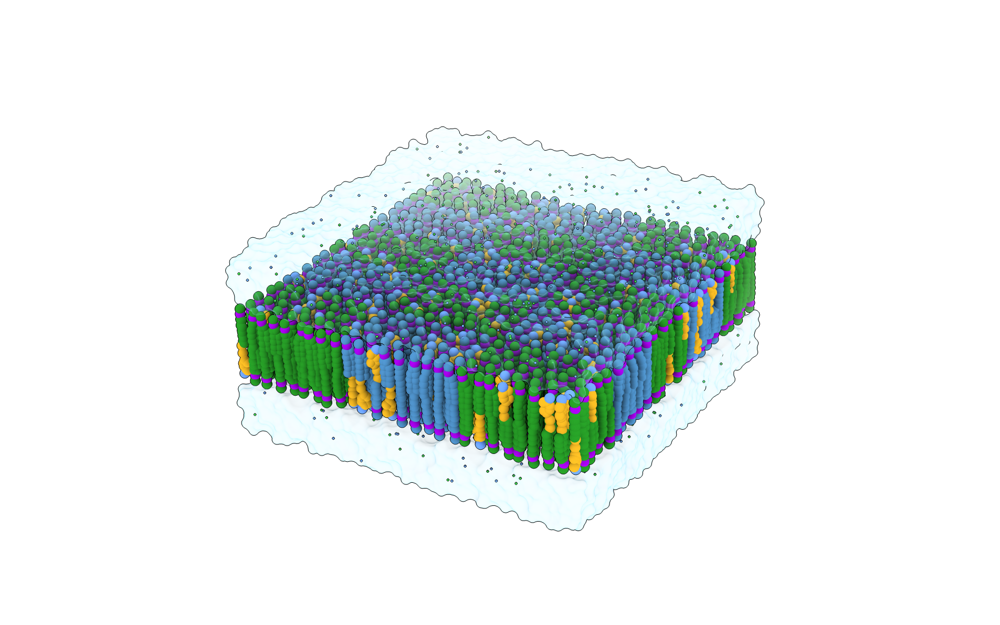

* **Multiple bilayers system**: Two membranes offset in the z direction

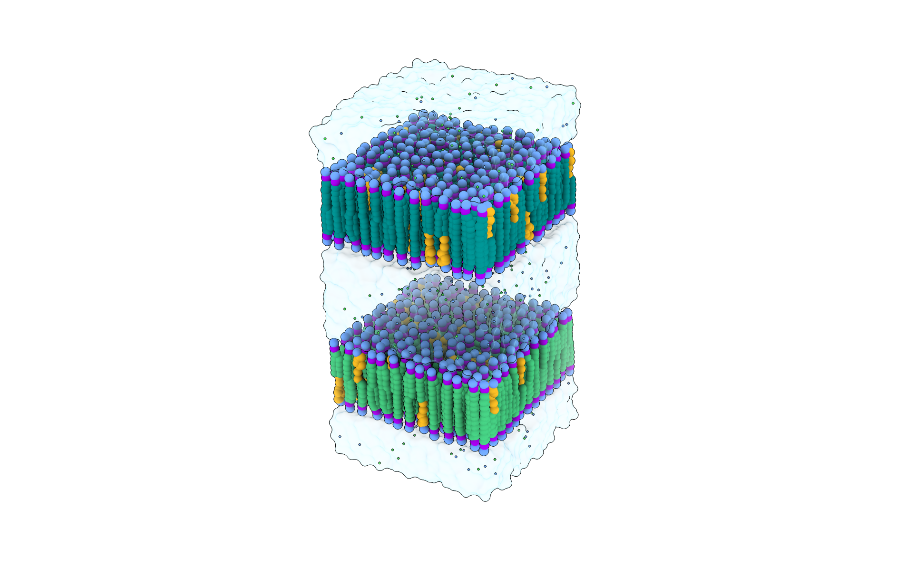

* **Monolayer system**: An upper-facing complex monolayer

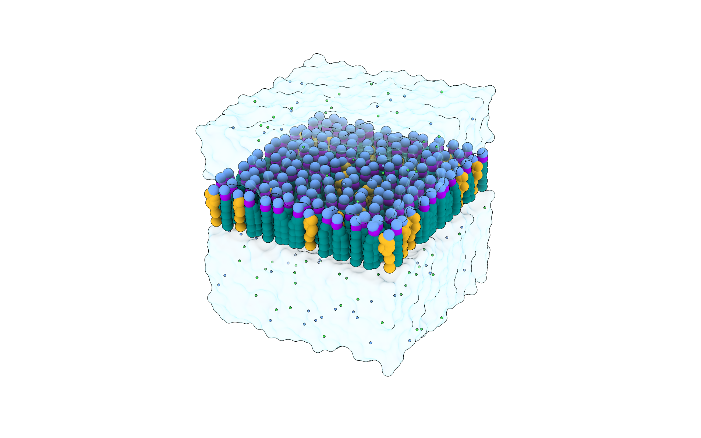

* **Mixed solvent system**: A symmetric complex membrane solvated with regular and small water beads in specified ratios

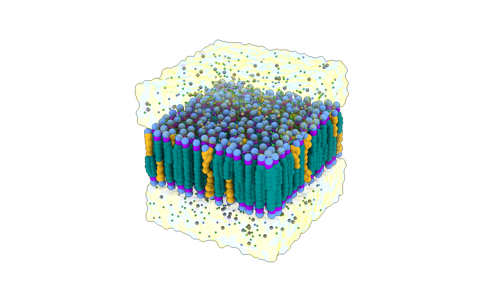

* **Flooding system**: A membrane system that has been flooeded with solute molecules, followed by solvation

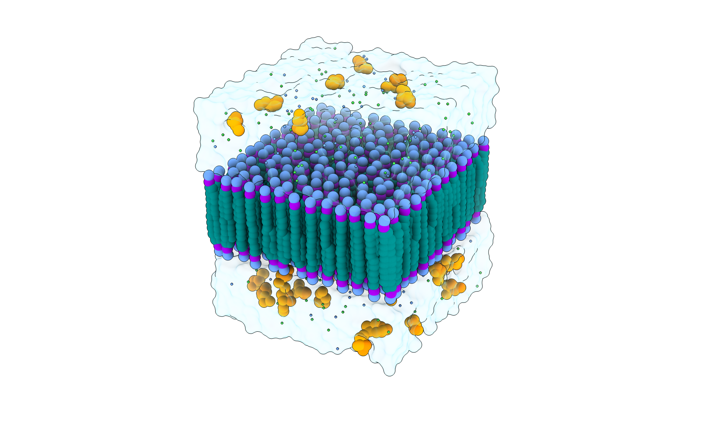

* **Abstract art**: Just for fun

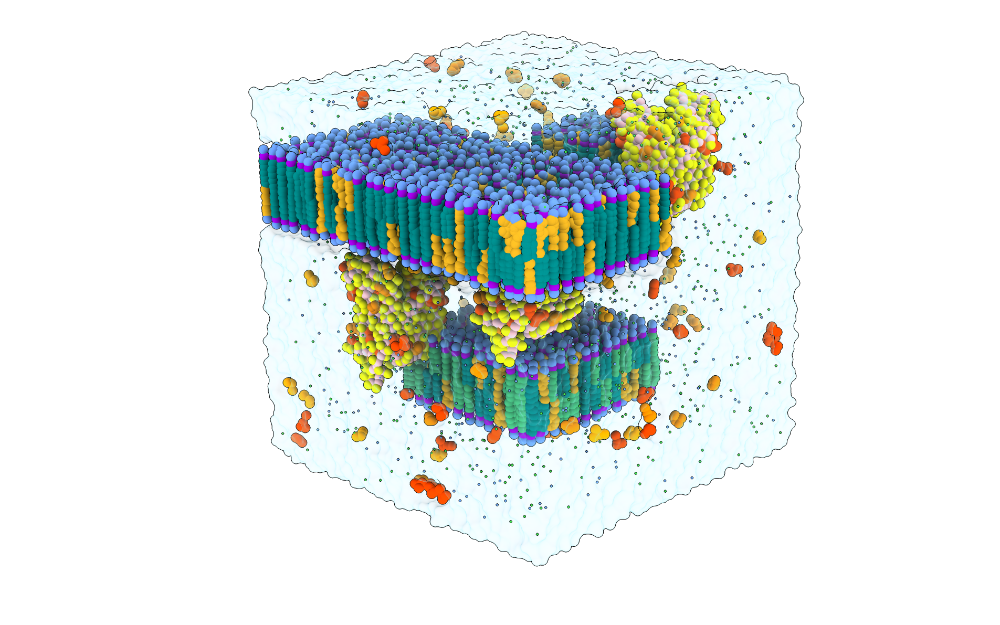
