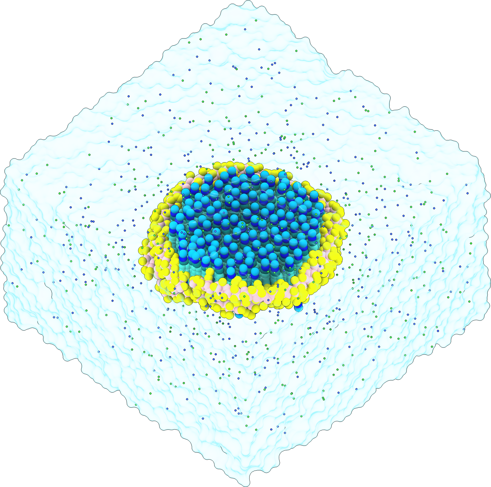
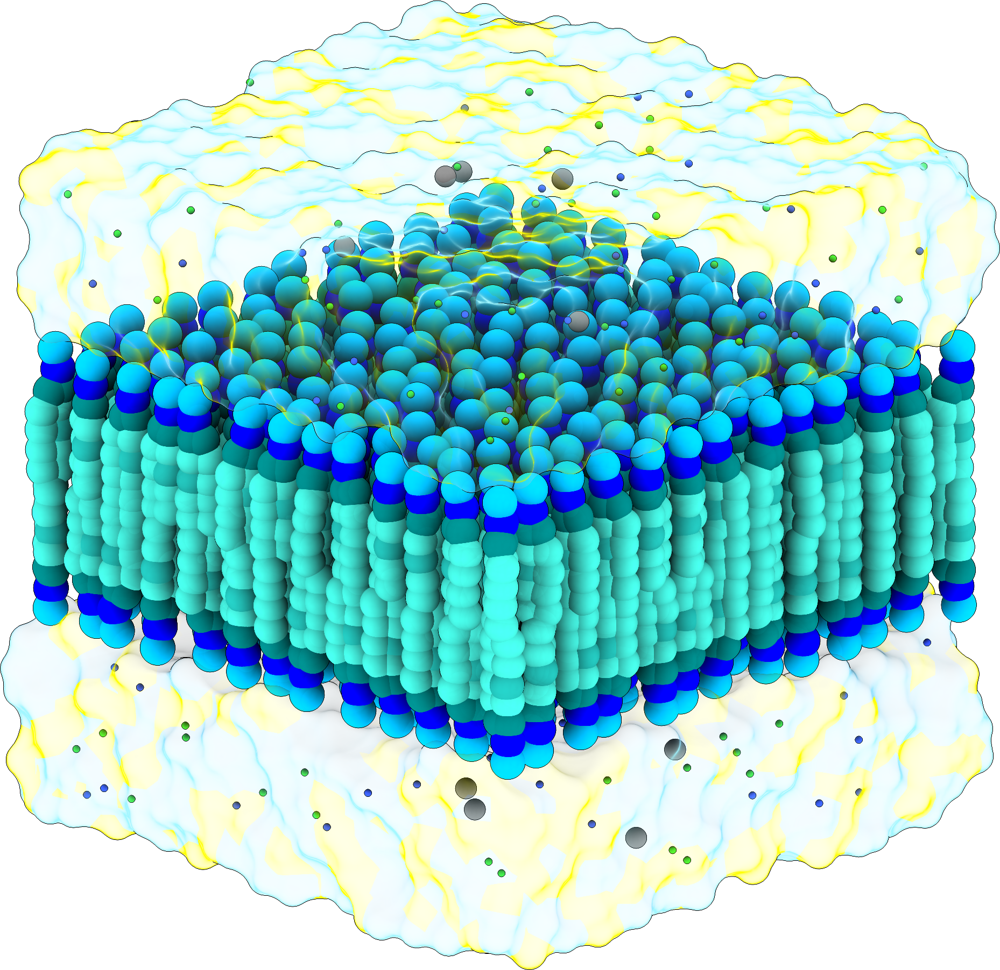

# COBY Tutorial

For a detailed introduction to the software, please refer to the [COBY Documentation](../COBY_Documentation.pdf).

For a quick reminder of available commands, you can use the [Cheat Sheet](../COBY_Cheat_Sheet.pdf).

Three tutorials are available as Jupyter Notebooks: basic, advanced, and a tutorial creating the showcased systems from the manuscript.

Tutorial ToC:

## **1. Basic Tutorial**

* **General command explanation**: A simple POPC membrane with a protein in solvent (water + 0.15 M NaCl)

* **Membranes**
    * **Change APL**
    * **Complex symmetric membrane**
    * **Complex asymmetric membrane**: consisting of POPC, POPE, and CHOL with different APL values for each leaflet

* **Proteins**
    * **Move and rotate**
    * **Centering methods**
    * **Protein with ligands**
* **Solvation**
    * **Changing the ion concentration**
* **Box Types**
    * **Hexagonal box**
    * **Skewed hexagonal box**
    * **Dodecahedron**

## **2. Advanced Tutorial**

* **Multiple arguments**
* **Membranes**
    * **Phase separation**: featuring a checkerboard pattern of membrane patches

*    * **Monolayers**: consisting of two monolayers with solvent bridging the headgroups and the vacuum bridging the tails

*    * **Lipid optimisation**
* **Nanodisc**: a disc with DMPC lipids contains within the protein rings

* **Pores (holes)**
    * **A membrane with a solvated hole**
    * **A membrane with an unsolvated hole**
    * **Multiple holes**
    * **Polygons**: A membrane with multiple holes defined as polygonal shapes

* **Membrane Patches**
    * **A circular patch with the solvent in the membrane plane**
    * **A circular patch without the solvent in the membrane plane**
    * **Multiple membrane patches**

* **Membrane holes and patches**
    * **Phase separation**
    * **Modifying shapes**
    * **Matryoshka membrane**: membrane concentric circles with a protein in the centre

* **Stacked membranes**
    * **Three bilayers**

* **Solvation**
    * **Changing the solvent concentration**
    * **Charge neutralisation methods**
    * **Mixed solvent**: A membrane solvated with regular and small water beads in specified ratios
    

*    * **Phase-separated solvent**: A membrane solvated with two solvent volumes containing different salt concentrations

* **Flooding**
	* **From the library**
	* **Import a solute molecule**: A membrane protein flooded with imported sucrose molecules

*	* **Import multiple solutes**
*	* **Import a lipid**
* **Custom unit cell**
* **COBY logo**

## **3. Manuscript tutorial**

* **Neuronal membrane**: Complex asymmetric membrane containing 58 lipid types.
* **Monolayers**: Two monolayers with solvent bridging the headgroups and vacuum bridging the tails.
* **Multiple solvent spaces**: Two voltage-gated potassium channels with modelled ion gradients.
* **Phase-separated membrane**: A phase-separated giant unilamellar vesicle membrane featuring liquid-ordered and liquid-disordered patches.
* **SARS-CoV-2 spike protein extended intermediate**: A viral and a host membrane bridged by an extended intermediate of the SARS-CoV-2 spike protein.
* **Gram-negative bacteria outer membrane and periplasm**: An example of a crowded system, featuring an asymmetric bilayer, four protein types, and four different solutes.
* **Multilamellar system with lipid-DNA complexes**: A type of a system used as an artificial transfection agent, featuring four stacked bilayers and DNA molecules in the inter-membrane spaces. 
* **Nanodic**
* **SIRAH force field**: Implementation of SIRAH molecules in COBY. 
* **Protein with benzene**: A benzene flooding setup surrounding a human K-Ras protein. 
* **Ionic liquid**: A solvent consisting of four types of cations and one type of anions in a liquid phase. 

