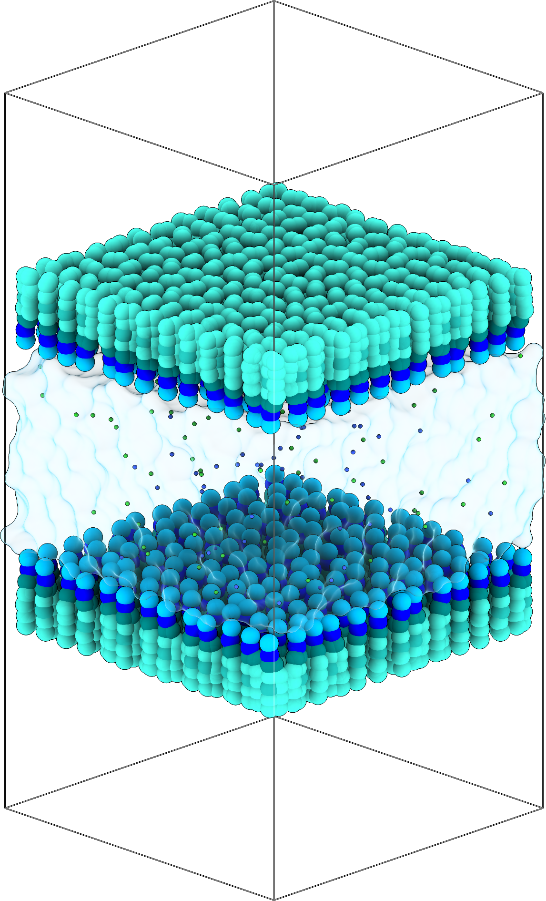
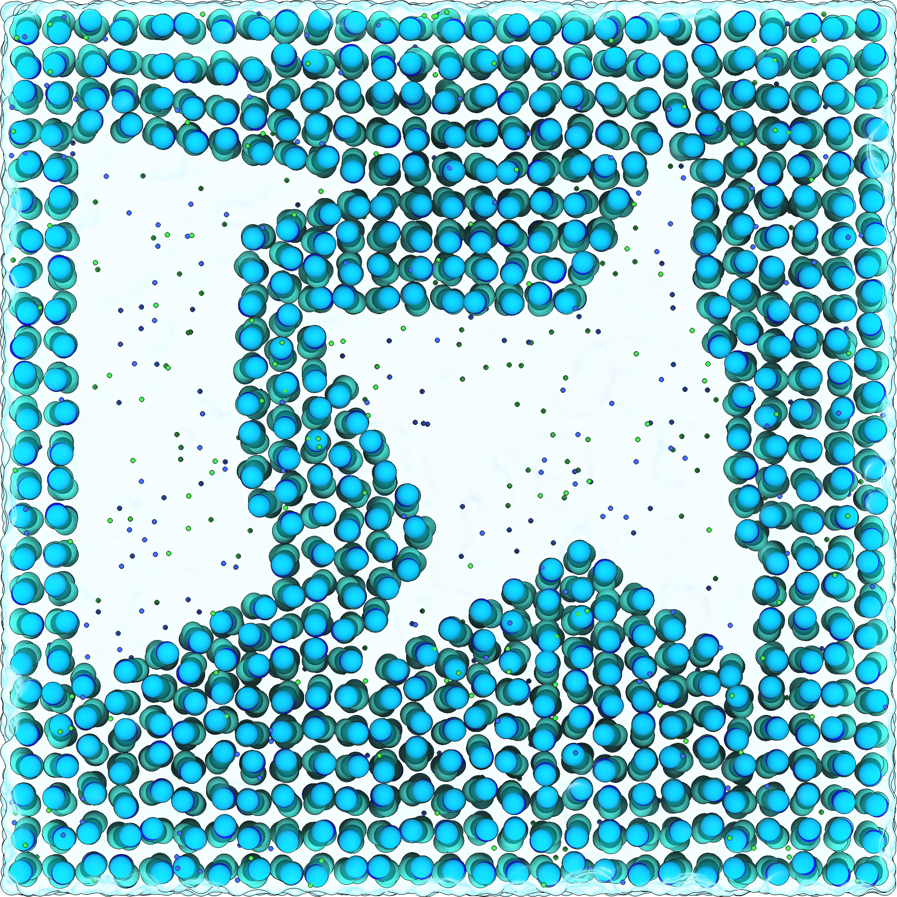
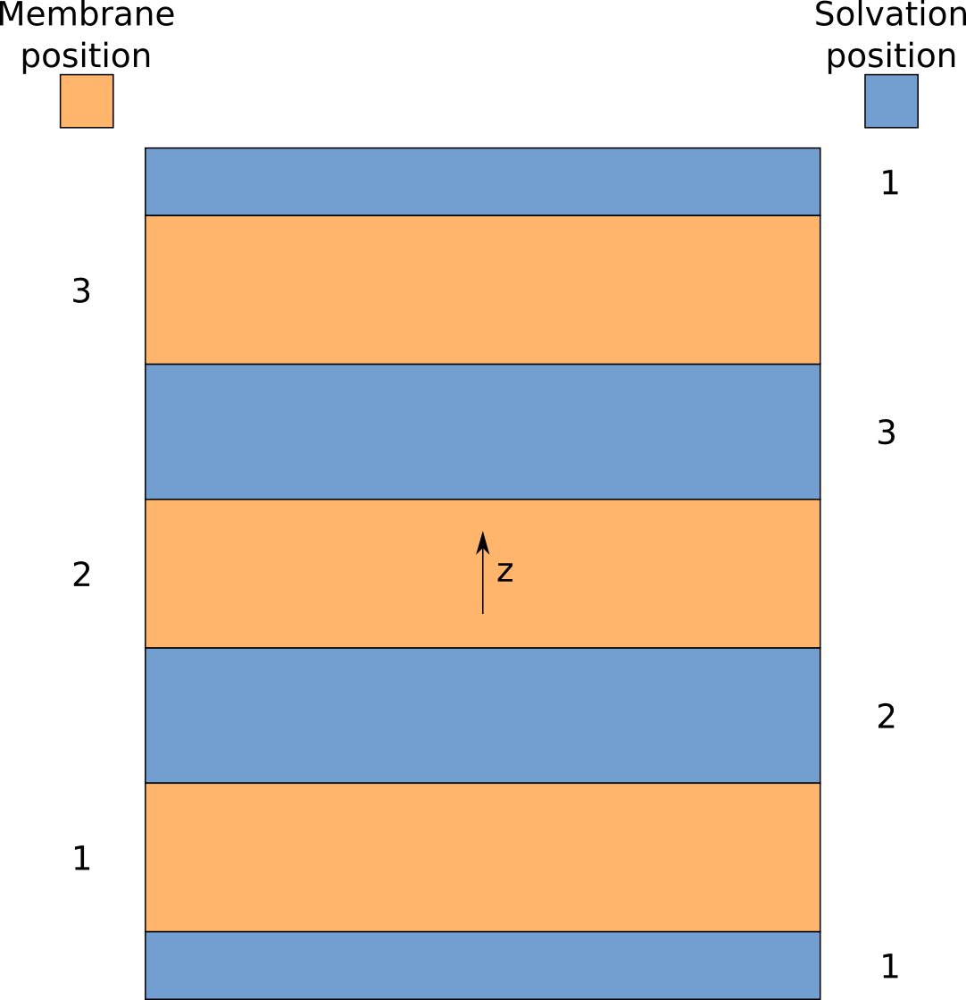

# CGSB Tutorial

For a detailed introduction to the software, please consult [CGSB Documentation](../CGSB_Documentation.pdf).

For a quick reminder of available commands, you can use the [Cheat Sheet](../CGSB_Cheat_Sheet.pdf).

This tutorial is available as a Jupyter Notebook and it systematically presents build procedures, from very simple to very complex systems.

It includes (amongst other systems):

* **Simple membrane with protein**: A simple POPC membrane with a protein in solvent (water + 0.15 M NaCl) which explains the various arguments in CGSB

* **Asymmetric membrane**: An asymmetric complex membrane (POPC, POPE and CHOL) in solvent with different area per lipid values for each membrane

* **Phase separated Membrane**: A phase separated membrane

* **Monolayers**: Two monolayers with solvent between them and vacuum over the pbc

* **Nanodisc**: A nanodisc with DMPC lipid contained within and with solvent surrounding it

* **Holes**: A membrane with multiple manually defined holes

* **Patches**: Multiple manually shaped membrane patches

* **Matryoshka membrane**: A matryoshka membrane with a protein in the center

* **Stacked membranes**: Three vertically stacked membranes

* **Mixed solvent**: A symmetric membrane solvated with regular and small water beads in specified ratios

* **Phase separated solvent**: A symmetric membrane solvated with two solvent volumes containing different salt concentrations

* **Flooding of imported solutes**: A membrane system that has been flooded with imported solute molecules, followed by solvation

* **CGSB logo**: Our logo

